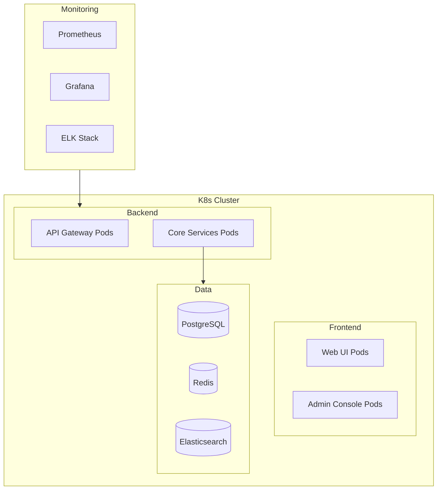

# CE-OS 系统架构设计

## 1. 技术栈选型

### 后端技术栈
- **微服务框架**: Spring Boot 3.x
- **服务注册与发现**: Spring Cloud Eureka
- **API网关**: Spring Cloud Gateway
- **消息队列**: RabbitMQ
- **数据库**: 
  - PostgreSQL (主数据库)
  - Redis (缓存)
- **搜索引擎**: Elasticsearch
- **AI服务**: 
  - OpenAI API (主要LLM)
  - HuggingFace (本地轻量模型)

### 前端技术栈
- **框架**: React 18 + TypeScript
- **状态管理**: Redux Toolkit
- **UI组件库**: Ant Design
- **图表**: ECharts
- **构建工具**: Vite

### DevOps
- **容器化**: Docker
- **编排**: Kubernetes
- **CI/CD**: GitHub Actions
- **监控**: 
  - Prometheus
  - Grafana
  - ELK Stack

## 2. 系统架构图

```mermaid
graph TB
    subgraph Frontend
        UI[Web UI]
        Admin[Admin Console]
    end

    subgraph Gateway
        API[API Gateway]
        Auth[Auth Service]
    end

    subgraph Core Services
        Fetch[RSS Fetch Service]
        Eval[AI Evaluator]
        Class[AI Classifier]
        Format[Markdown Formatter]
        Archive[Archivist Service]
        Report[Report Engine]
    end

    subgraph Infrastructure
        MQ[RabbitMQ]
        DB[(PostgreSQL)]
        Cache[(Redis)]
        ES[(Elasticsearch)]
    end

    UI --> API
    Admin --> API
    API --> Auth
    API --> Core Services
    
    Fetch --> MQ
    MQ --> Eval
    Eval --> Class
    Class --> Format
    Format --> Archive
    
    Core Services --> DB
    Core Services --> Cache
    Core Services --> ES
```

## 3. 服务说明

### 核心服务
1. **RSS Fetch Service**
   - 负责RSS源的定时抓取
   - 支持自定义抓取周期
   - 失败重试机制

2. **AI Evaluator**
   - 调用LLM进行内容评估
   - 支持多套评估规则
   - 批量处理优化

3. **AI Classifier**
   - 多标签分类
   - 支持自定义标签集
   - 置信度阈值控制

4. **Markdown Formatter**
   - 统一Markdown格式
   - Front-Matter处理
   - 元数据提取

5. **Archivist Service**
   - 文件系统管理
   - 版本控制集成
   - 增量备份

6. **Report Engine**
   - 模板渲染
   - 数据聚合
   - 多格式输出

### 基础设施
1. **消息队列**
   - 服务间解耦
   - 任务调度
   - 失败重试

2. **数据库**
   - 结构化数据存储
   - 事务管理
   - 数据一致性

3. **缓存**
   - 热点数据缓存
   - 会话管理
   - 限流控制

4. **搜索引擎**
   - 全文检索
   - 标签搜索
   - 相关性排序

## 4. 部署架构



## 5. 安全设计

1. **认证与授权**
   - JWT token认证
   - RBAC权限控制
   - API访问控制

2. **数据安全**
   - 传输加密(HTTPS)
   - 敏感数据加密
   - 数据备份策略

3. **网络安全**
   - API网关防护
   - 限流控制
   - IP白名单

## 6. 扩展性设计

1. **水平扩展**
   - 无状态服务设计
   - 负载均衡
   - 自动扩缩容

2. **垂直扩展**
   - 模块化设计
   - 插件化架构
   - 配置中心

3. **AI模型扩展**
   - 模型版本管理
   - A/B测试支持
   - 模型热更新 